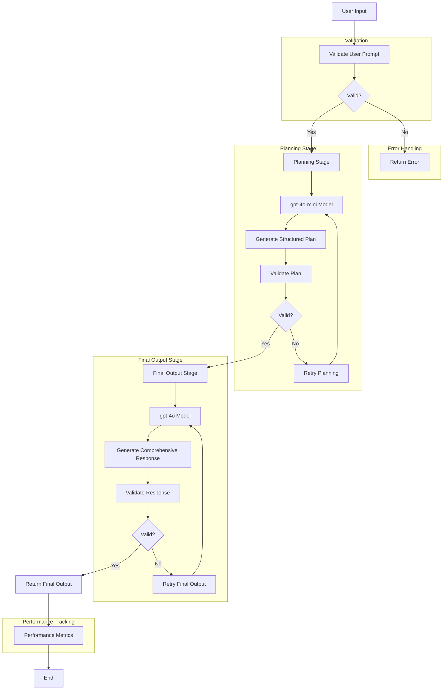

# AI-Powered Prompt Chaining System

## Overview

This solution implements a structured approach to prompt chaining using Azure OpenAI's GPT-4o models. The goal is to decompose complex user prompts into manageable stages, leveraging the capabilities of a smaller model (gpt-4o-mini) for planning and the full-scale model (gpt-4o) for generating comprehensive, high-quality responses. The process is designed to maximize reasoning, clarity, and efficiency by dividing the task into two distinct stages:

1. Planning Stage:

   - Uses gpt-4o-mini to create a structured plan based on the user's initial prompt.
   - Breaks down the task into actionable components, each described with its importance and key considerations.

2. Final Output Stage:
   - Utilizes gpt-4o to synthesize a detailed and holistic response, grounded in the structured plan generated during the planning stage.

## Process Flow

The following Mermaid diagram illustrates the detailed process flow of the AI-Powered Prompt Chaining System:



This diagram showcases the following key aspects of the system:

1. User input validation
2. Two-stage processing (Planning and Final Output)
3. Use of different models (gpt-4o-mini and gpt-4o)
4. Validation steps throughout the process
5. Retry mechanisms for both planning and final output stages
6. Error handling
7. Performance tracking

## Goals

1. Enhance Reasoning Quality:

   - By breaking down the problem into smaller, well-defined sub-tasks, the solution encourages the AI to reason through each component and produce a more thoughtful and coherent final output.

2. Optimize Resource Utilization:

   - Offloading the planning to gpt-4o-mini, a less computationally expensive model, reduces costs and response times while reserving the full model's power for the detailed response.

3. Modular and Reusable Design:

   - The solution is designed with clear modularity, enabling easy customization and reuse for a wide range of use cases, from strategic planning to report generation.

4. Improve Prompt Effectiveness:

   - Through structured, multi-step prompting, the approach overcomes the limitations of single-shot prompts, enhancing the relevance, depth, and accuracy of responses.

5. Scalability and Extendibility:

   - The architecture supports scalable deployment and integration with additional models or features, such as interactive feedback loops, dynamic token management, or response validation mechanisms.

6. Transparency and Traceability:
   - Logging and displaying the prompts and responses at each stage ensures traceability and enables better understanding of the AI's decision-making process.

## Key Features

- **Two-Stage Processing**: Utilizes gpt-4o-mini for planning and gpt-4o for final output generation.
- **Robust Error Handling**: Implements custom exceptions, retry mechanisms, and validation checks for improved reliability.
- **Configurable Settings**: Centralized configuration management for easy parameter adjustments.
- **Input and Output Validation**: Ensures high-quality responses through thorough validation and quality assessment.
- **Performance Tracking**: Detailed execution statistics for monitoring and optimization.
- **Modular Design**: Well-structured code for easy maintenance and extensibility.

## Requirements

- Python 3.7+
- Azure OpenAI API access
- Required Python packages: `openai`, `python-dotenv`

## Setup

1. Clone the repository:

   ```
   git clone https://github.com/terilios/reasoning-iteration.git
   ```

2. Install required packages:

   ```
   pip install openai python-dotenv
   ```

3. Create a `.env` file in the root directory and add your Azure OpenAI credentials:
   ```
   AZURE_OPENAI_API_KEY=your_api_key
   AZURE_OPENAI_API_BASE=your_api_base
   AZURE_OPENAI_API_VERSION=your_api_version
   AZURE_OPENAI_DEPLOYMENT_NAME=your_deployment_name
   AZURE_OPENAI_MINI_DEPLOYMENT_NAME=your_mini_deployment_name
   ```
   Note: The `.env` file is included in `.gitignore` to prevent sensitive information from being uploaded to the repository.

## Usage

The script supports two modes of operation:

1. Direct Command Line:

   ```bash
   python main.py "Your prompt here"
   ```

2. Interactive Mode:
   ```bash
   python main.py
   ```
   Then enter your prompt when prompted. Press Enter twice to submit.

The script will:

1. Process your prompt through the planning stage using gpt-4o-mini
2. Generate a detailed response using gpt-4o
3. Write the results to results.md with:
   - Original prompt
   - Generated plan
   - Enhanced response
   - Execution statistics including:
     - Total tokens used
     - Stage durations
     - Token usage per stage
     - Retry counts
     - Validation results

## Code Structure and Approach

### Strengths:

- Clear Separation of Concerns: The code is well-organized into distinct functions for planning and output generation.
- Robust Error Handling: Try-except blocks are properly implemented in each stage.
- Good Configuration Management: Environment variables are used for sensitive configuration.
- Helpful Debugging Features: Comprehensive logging of prompts and responses, and performance metrics tracking.

### Areas for Improvement:

- Response Validation: Enhance quality checks for the planning stage output and final response.
- Configuration Enhancement: Add more configurable parameters for flexibility.
- Enhanced Error Recovery: Implement more sophisticated retry logic with exponential backoff.
- Extensibility: Add support for custom prompt templates and async operations.
- Documentation: Expand docstrings and add more type hints for better code clarity.

## Contributing

Contributions to enhance the functionality or efficiency of the system are welcome. Please submit a pull request with your proposed changes.

## License

This project is licensed under the MIT License - see the [LICENSE](LICENSE) file for details.

## Output Format

The script generates a markdown file (results.md) with the following structure:

```markdown
# AI Response Analysis

## Original Prompt

[Your input prompt]

## Generated Plan

[Structured plan from gpt-4o-mini]

## Enhanced Response

[Detailed response from gpt-4o]

## Execution Statistics

[JSON object containing performance metrics]
```

The execution statistics include:

- Total duration of execution
- Total tokens used across all stages
- Duration of each stage (planning and output)
- Token usage per stage
- Number of retries if any
- Validation results for response quality

## Summary

This solution leverages Azure OpenAI's models to tackle complex tasks with greater efficiency and thoughtfulness. By employing a structured, two-stage approach with comprehensive token tracking and performance monitoring, it enhances both the quality of the AI's output and the scalability of its application in various domains, such as strategic planning, content generation, and process optimization.
